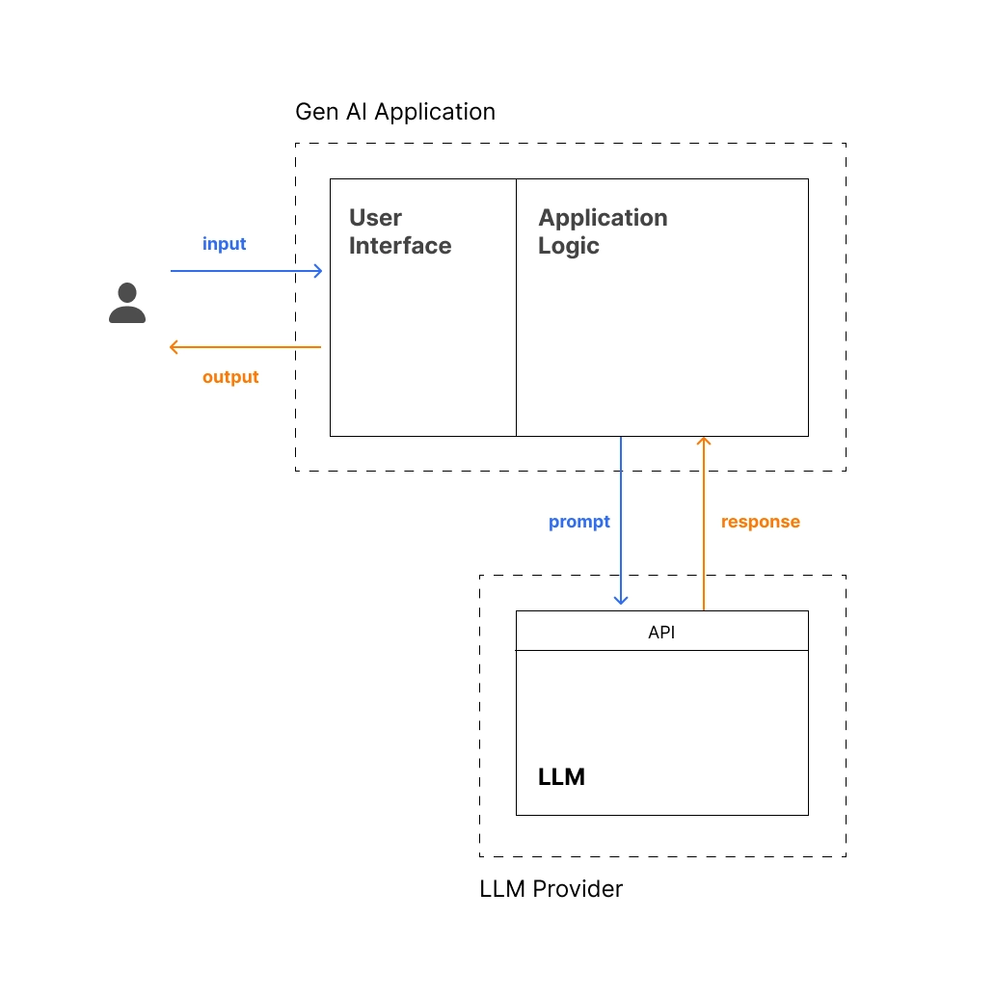

Here are a few terms that are hot in tech right now:

Intelligence Explosion — the idea that AI could rapidly self-improve beyond human control
Quantum Supremacy — when a quantum computer solves a problem no classical computer can
Scaling Laws — the relationship between model size, compute, and performance

This diagram shows the architecture that most LLM applications share. At a high level, there are three main pieces working together:

User Interface — where the user provides input and sees the response
Application Logic — the brain of the app: constructs the prompt, calls the LLM, and handles the response
LLM Provider — the external service (like OpenAI) that actually generates the output

It all starts with the User on the left — they type in a concept they want explained. That input flows into the User Interface, which passes it to the Application Logic.

Inside the Application Logic, three things happen:

Prompt Construction — the raw input is wrapped into a well-structured prompt that guides the LLM
API Communication — that prompt is sent to the LLM Provider (e.g., OpenAI) via their API
Response Handling — the LLM's response comes back and gets passed to the UI for the user to see
The LLM Provider sits outside your application entirely — it's an external service you call over the internet. Your app never "contains" the model; it just talks to it.

Now, to actually build this, we need a way to communicate with LLM providers. That's where LangChain comes in

LangChain is a framework for building LLM-powered applications. It gives you two key things:

A design methodology — a thoughtful, structured approach to architecting LLM apps
A collection of modular components — pre-built building blocks for common LLM operations like prompt management, model calls, and response handling
As you can see here, LangChain sits inside the Application Logic layer, acting as the bridge between your app and the LLM provider.

Here's why we use it over provider SDKs directly:

Development Speed — pre-built components mean you write far less boilerplate
Provider Abstraction — swap between OpenAI, Anthropic, or others without changing your app's code
Active Community — frequent updates, extensions, and a large ecosystem to draw from

Time to write some code

from langchain.chat_models import init_chat_model — gives us a function to connect with an LLM
from langchain_core.prompts import PromptTemplate — gives us tools to manage prompts

Perfect — imports are in and ready to go! ✅

Next up: authentication. Before we can call any LLM, we need API keys.

Each LLM provider requires an API key to authenticate your requests. Here's how to get one:

OpenAI: Create an account at OpenAI Platform and generate a key from the dashboard
Anthropic: Sign up at Anthropic Console and create a key in settings
Other providers: Each has a similar process through their developer portal
The key looks something like this: sk-proj-... — a long string that identifies and authenticates your application

you'll need to manage keys carefully. The golden rule: never hardcode API keys directly in your code. If someone accesses your codebase, they get your keys — and your credits.

The right approach is to store them in a .env file:

Add your keys there: OPENAI_API_KEY=sk-proj-...
Load them in code using load_dotenv() from the dotenv library
LangChain automatically reads variables like OPENAI_API_KEY when initializing models
Always add .env to your .gitignore to keep keys out of your codebase

from langchain.chat_models import init_chat_model
from langchain_core.prompts import PromptTemplate
import os
from dotenv import load_dotenv

load_dotenv()

prompt_template_str = """
Your task is to explain the concept of **{concept}** to me in a way that is:

1. Clear and intuitive
2. Concise (in under 100 words)
3. Tailored specifically to me and what I already know

Use the following information about me to personalize your explanation:

- Role: AI Engineer
- Goal: Building LLM-powered applications end-to-end from scratch
- Background: Software engineering and AI development

The personalization should be subtle and natural. Avoid forced references that don't genuinely enhance understanding.
"""

The prompt template string is in place. ✅

Now let's turn it into a LangChain PromptTemplate object and test it out. Do you know what string templates and template variables like {concept} are

A string template is just a string with placeholder variables that get replaced with actual values at runtime.

You already have one — notice {concept} in your prompt. That's the placeholder. When you call .format(concept="Scaling Laws"), LangChain swaps {concept} with "Scaling Laws" to produce the final prompt sent to the LLM.

This makes your prompt reusable — one template, infinite inputs.

Now let's put it to use. Add this code right after your prompt string:

# Create a prompt template
prompt_template = PromptTemplate.from_template(prompt_template_str)

# Define the input variable
concept = "Scaling Laws"

# Format the prompt
prompt = prompt_template.format(concept=concept)

print(prompt)

This creates a PromptTemplate object from your string, then formats it with a concept to see exactly what gets sent to the LLM.

Now for the exciting part — let's actually call the LLM! Add this code after your prompt formatting:

# Create a model interface
model = init_chat_model("gpt-4o-mini", model_provider="openai")

# Call the model with the prompt
response = model.invoke(prompt)

# Print the generated content
print(response.text)

That's your app talking to an LLM for the first time! 🎉 And look at that response — personalized, concise, and directly relevant to you as an AI engineer building LLM apps.

Notice how simple the integration actually is:

init_chat_model() creates a model interface for a given provider — just a name and provider string
model.invoke() sends the prompt and returns the full response
response.text extracts the generated content — that's what you'd display to a user
Three lines to connect your app to a powerful LLM. That's the beauty of LangChain.

Now let's give this a proper UI. Since building frontends isn't our focus here, we'll use Gradio — a lightweight Python library that lets you spin up a functional web interface with just a few lines of code. No HTML, no JavaScript needed.

Gradio is an open-source Python library by Hugging Face that creates simple web interfaces with minimal code — no frontend experience required. It's built specifically for AI engineers and ML practitioners to quickly demo and test their models and applications.

You define:

The function to call when the user submits input
The input fields (text boxes, dropdowns, etc.)
The output fields to display the response
Gradio handles all the web rendering for you.

Before adding the Gradio code, we need to wrap our LLM logic in a function. Gradio needs a function to call when the user submits input.

Here's what I'd like you to do:

Create a function called generate_explanation() that takes input_text as an argument
Move the prompt formatting and model call inside it
Return only response.text
Keep prompt_template and model initialized outside the function
Remove the print statements and the concept variable
Give it a try and hit Submit when ready!

# Your code goes here
from langchain.chat_models import init_chat_model
from langchain_core.prompts import PromptTemplate
import os
from dotenv import load_dotenv

load_dotenv()

prompt_template_str = """
Your task is to explain the concept of **{concept}** to me in a way that is:

1. Clear and intuitive
2. Concise (in under 100 words)
3. Tailored specifically to me and what I already know

Use the following information about me to personalize your explanation:

- Role: AI Engineer
- Goal: Building LLM-powered applications end-to-end from scratch
- Background: Software engineering and AI development

The personalization should be subtle and natural. Avoid forced references that don't genuinely enhance understanding.
"""

# Create a prompt template
prompt_template = PromptTemplate.from_template(prompt_template_str)

# Define the input variable
concept = "Scaling Laws"
model = init_chat_model("gpt-4o-mini", model_provider="openai")

def generate_explanation(input_text):
    prompt = prompt_template.format(concept=input_text)
    response = model.invoke(prompt)
    return response.text

Now let's add the Gradio interface
import gradio as gr

demo = gr.Interface(
    fn=generate_explanation,
    inputs=[gr.Textbox(label="Concept", lines=1)],
    outputs=[gr.Textbox(label="Explanation", lines=5)],
    flagging_mode="never",
    title="Personalized Concept Explainer",
    description="Enter any concept and get a personalized explanation"
)

demo.launch()

# Your code goes here
from langchain.chat_models import init_chat_model
from langchain_core.prompts import PromptTemplate
import os
from dotenv import load_dotenv

load_dotenv()

prompt_template_str = """
Your task is to explain the concept of **{concept}** to me in a way that is:

1. Clear and intuitive
2. Concise (in under 100 words)
3. Tailored specifically to me and what I already know

Use the following information about me to personalize your explanation:

- Role: AI Engineer
- Goal: Building LLM-powered applications end-to-end from scratch
- Background: Software engineering and AI development

The personalization should be subtle and natural. Avoid forced references that don't genuinely enhance understanding.
"""

# Create a prompt template
prompt_template = PromptTemplate.from_template(prompt_template_str)

# Define the input variable
concept = "Scaling Laws"

model = init_chat_model("gpt-4o-mini", model_provider="openai")

def generate_explanation(input_text):
    prompt = prompt_template.format(concept=input_text)
    response = model.invoke(prompt)
    return response.text

import gradio as gr

demo = gr.Interface(
    fn=generate_explanation,
    inputs=[gr.Textbox(label="Concept", lines=1)],
    outputs=[gr.Textbox(label="Explanation", lines=5)],
    flagging_mode="never",
    title="Personalized Concept Explainer",
    description="Enter any concept and get a personalized explanation"
)

demo.launch()

LangChain automatically reads provider-specific environment variables (e.g., OPENAI_API_KEY)

in your .env we have to set OPENAI_API_KEY

LangChain automatically reads provider-specific environment variables (e.g., OPENAI_API_KEY)

